<div align="center">

# Drawli

**Вчимося малювати** · learn to draw, letter by letter

Планшетний застосунок, у якому дитина 4–10 років малює крок за кроком,
вчиться писати літери й цифри та грає в слова.
Працює у браузері, офлайн, **без реєстрації та без бекенду**.

[**▶ Відкрити застосунок**](https://polukovy.github.io/drawli/)

</div>

---

<div align="center">
  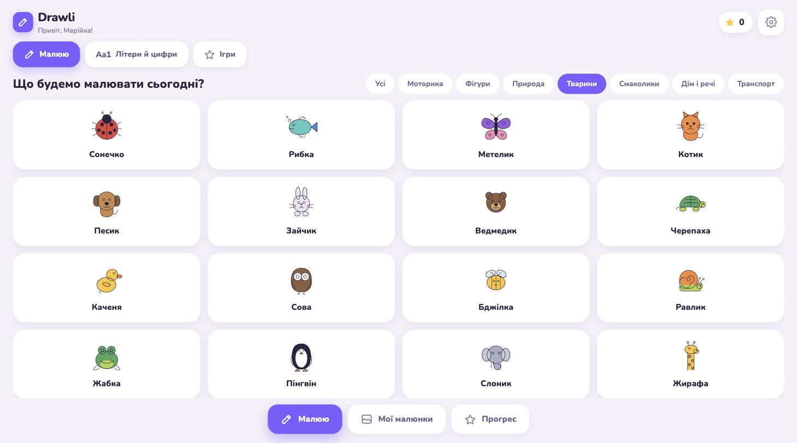
</div>

## Що це

Drawli — це не графічний редактор, а інтерактивний зошит для малювання.
Дитина обирає картинку, обводить пунктирний контур крок за кроком, розфарбовує
результат і отримує зірочки. Усе, що вона намалює, лишається на її планшеті:
жодного акаунту, жодної хмари, жодної реклами.

| | |
|---|---|
| **335 вправ** | 148 малюнків у 7 жанрах · 96 літер (укр / англ / ісп) · 91 число до 100 |
| **Дві мови інтерфейсу** | Українська та English, визначається автоматично |
| **Три гри** | «Склади слово», «Знайди малюнок» і «Обери артикль» — українською, English або Español |
| **Без реєстрації** | Дитина вводить лише ім'я |
| **Офлайн** | Встановлюється на домашній екран і працює без інтернету |
| **Від телефона до планшета** | Розкладка адаптується: iPhone, Android, iPad |
| **Без бекенду** | Дані живуть в IndexedDB, бекап — один JSON-файл |

## Як це виглядає

### Знайомство — лише ім'я, жодних акаунтів

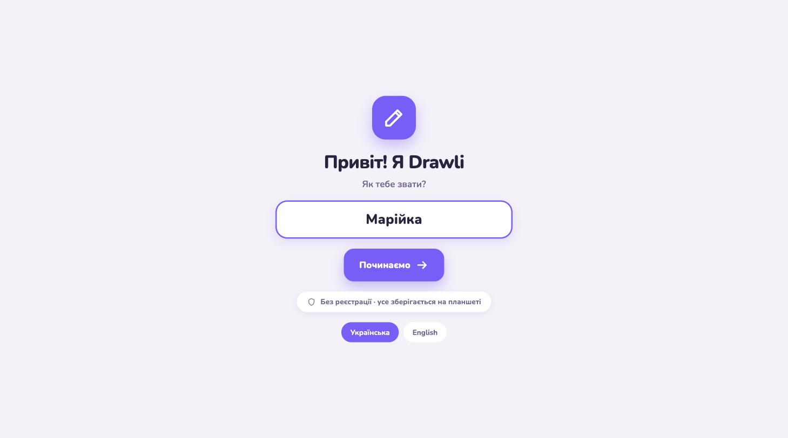

### Малювання по кроках

Сірий пунктир показує, що обводити. Фіолетова іскринка біжить по контуру й
показує, звідки починати. Праворуч — панель «Що малюємо» з фінальним малюнком
і кроками, які лишились.

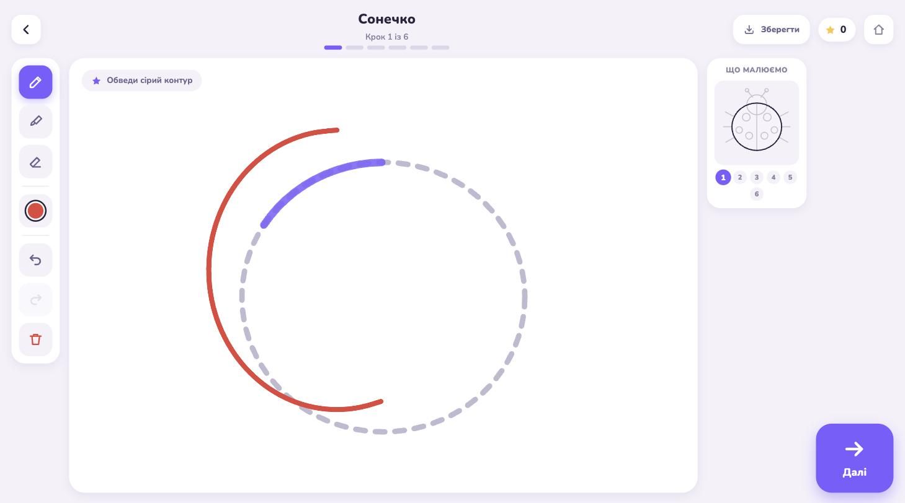

### Розфарбовування

Останній крок кожного малюнка — заливка. Дитина обирає колір і торкається
області: жодних промахів «повз контур».

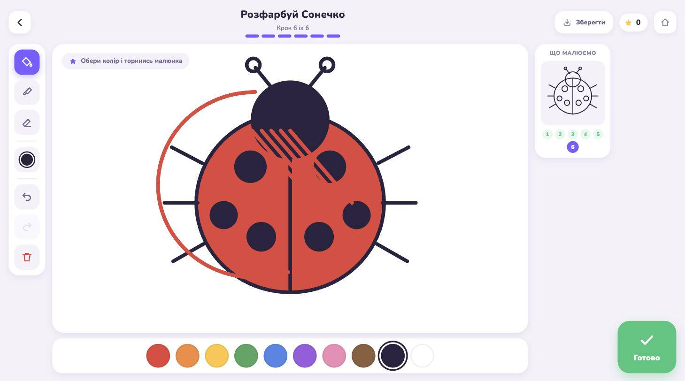

### Похвала

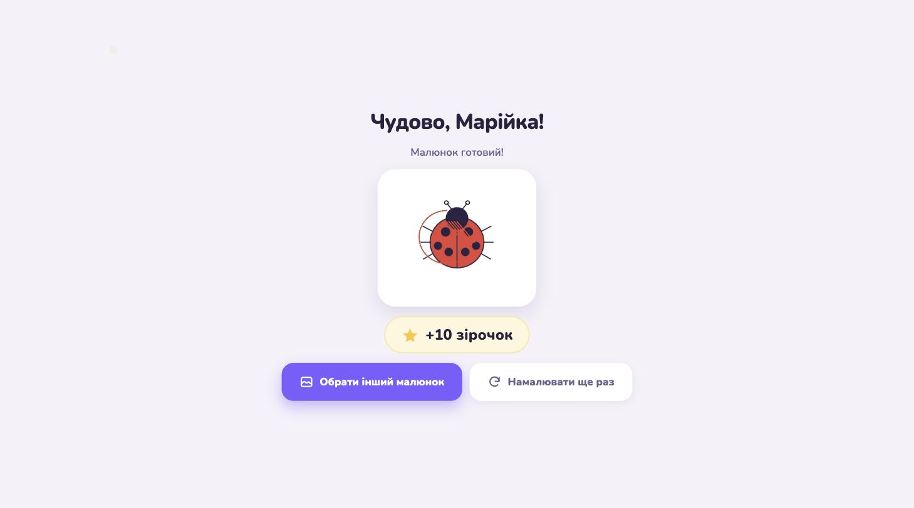

### Літери й цифри

Кожна літера написана по кроках у порядку письма. Іспанські літери мають назву
(`B · be`), числа 10–100 складаються з тих самих цифр.

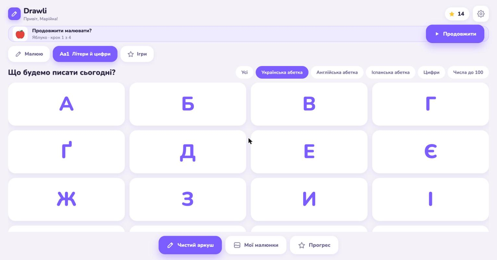

### Ігри

**«Склади слово»** — дитина обирає мову, дивиться на малюнок і збирає його
назву з літер-плиток. Помилка нічого не ламає: правильні літери лишаються,
решта повертається, а перша літера підказується.

**«Знайди малюнок»** — те саме навпаки: показано слово, треба впізнати
картинку серед чотирьох. Хибний варіант просто блідне й відходить убік.

**«Обери артикль»** — для англійської та іспанської: до слова треба дібрати
`a / an` або `el / la`.

Правильна відповідь — салют на весь екран, звук і автоперехід через 3 секунди.

<p>
  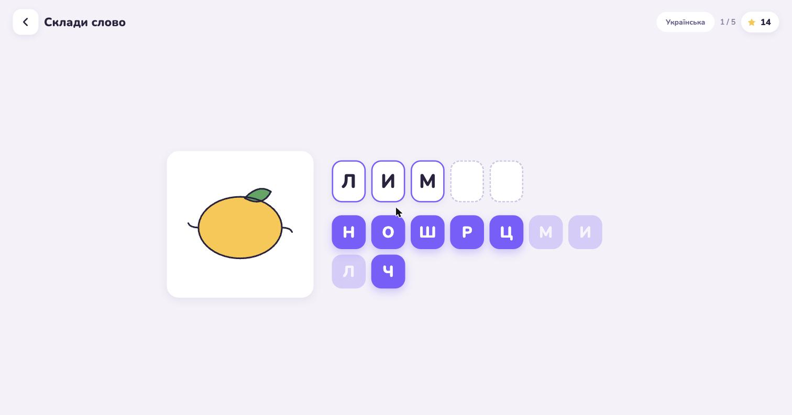
  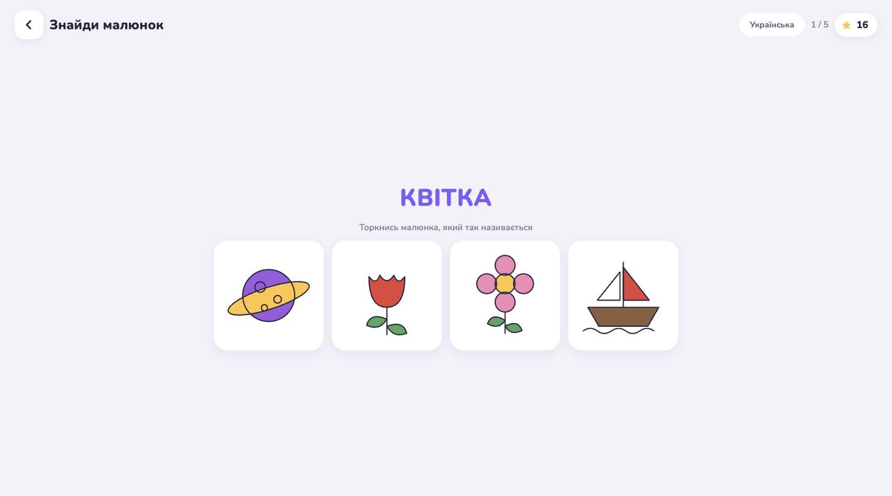
</p>

### Чистий аркуш

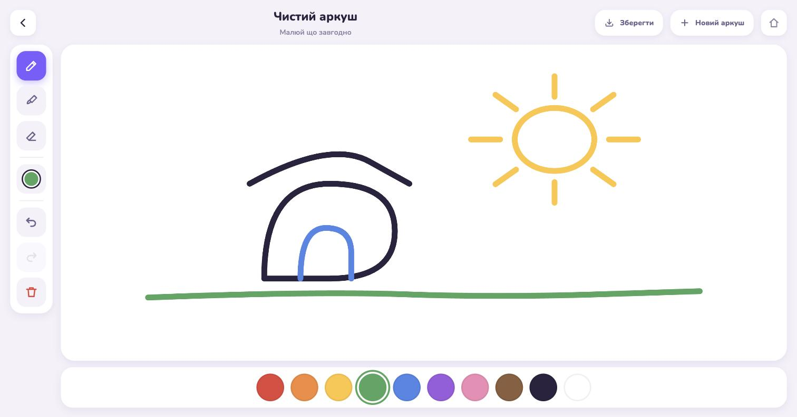

### Мої малюнки та прогрес

<p>
  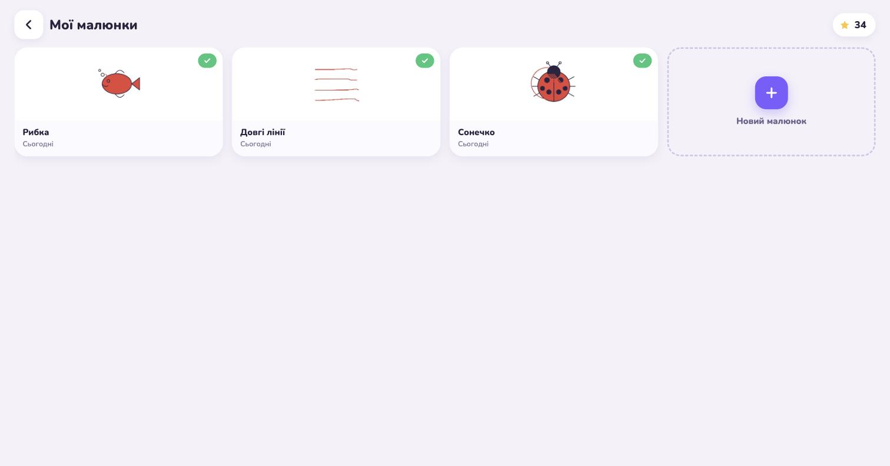
  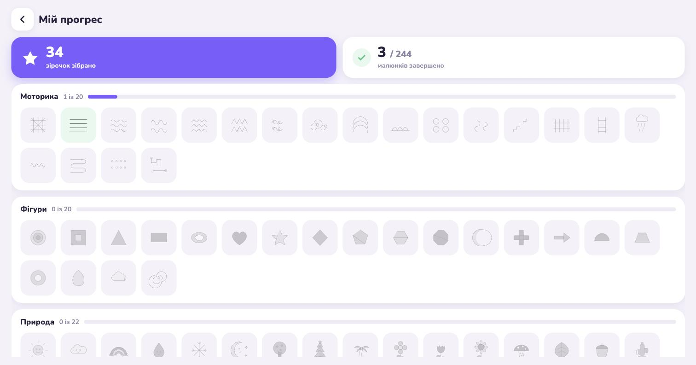
</p>

### Налаштування — з експортом та імпортом

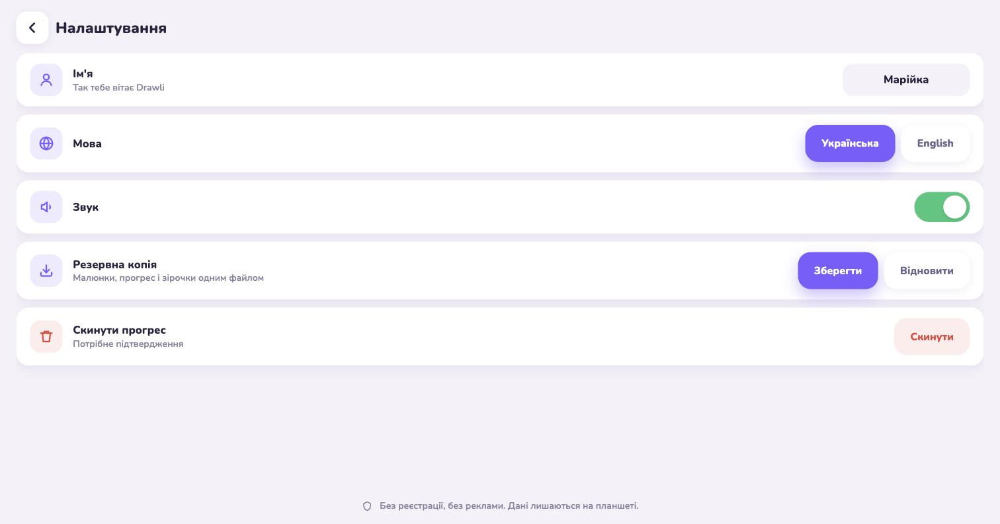

## Швидкий старт

```bash
npm install
npm run dev        # http://127.0.0.1:5173/drawli/
npm run build      # збірка у dist/
npm run exercises  # перегенерувати вправи з scripts/exercises/
```

Потрібен Node 22+. Деталі — у [doc/instruction.md](doc/instruction.md).

## Технології

```
React 19 · TypeScript · Vite 8 · React Router · Zustand
Canvas 2D + Pointer Events · SVG-гайди
Dexie / IndexedDB · i18next · vite-plugin-pwa (Workbox)
GitHub Actions → GitHub Pages
```

Жодного сервера, жодної бази даних, жодного стороннього API.

## Документація

| Документ | Про що |
|---|---|
| [doc/feature.md](doc/feature.md) | Повний перелік можливостей і як вони працюють |
| [doc/arch.md](doc/arch.md) | Архітектура: рушій малювання, дані, кеш, збірка |
| [doc/instruction.md](doc/instruction.md) | Для розробника: запуск, додавання вправ, деплой |
| [doc/how-to-use.md](doc/how-to-use.md) | Для батьків і дитини: як користуватись |
| [SPEC.md](SPEC.md) | Початкова специфікація MVP і фази розробки |

## Приватність

Drawli не питає ні email, ні дату народження, ні доступ до камери чи мікрофона.
Малюнки, прогрес і зірочки зберігаються **лише** в браузері на пристрої дитини.
Єдиний спосіб перенести їх — свідомо натиснути «Зберегти» в Налаштуваннях і
отримати файл `drawli-backup-YYYY-MM-DD.json`.

## In English

Drawli is a tablet-first PWA that teaches children aged 4–10 to draw, step by
step: 335 exercises (pictures, the Ukrainian / English / Spanish alphabets,
numbers to 100), three word games, and a blank sheet for free drawing. It runs
fully in the browser — no account, no backend, no ads — stores everything in
IndexedDB, and works offline once installed. See
[doc/feature.md](doc/feature.md) and [doc/arch.md](doc/arch.md).

## Ліцензія

[MIT](LICENSE) — застосунок вільний: будь-хто може ним користуватися, копіювати,
змінювати й поширювати, зокрема в комерційних проєктах. Достатньо зберегти
текст ліцензії.
