# Архітектура Drawli

Застосунок повністю клієнтський: жодного сервера, бази даних чи API.
GitHub Pages віддає статичні файли, усе інше відбувається в браузері планшета.

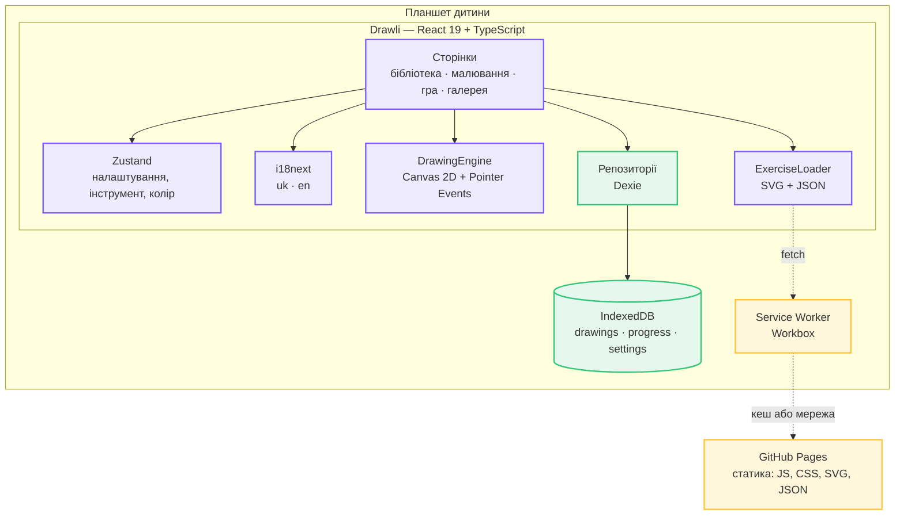

---

## 1. Межа між React і малюванням

Найважливіше архітектурне рішення: **координати вказівника ніколи не потрапляють
у React**. Якби кожен `pointermove` викликав `setState`, планшет губив би кадри
посеред штриха.

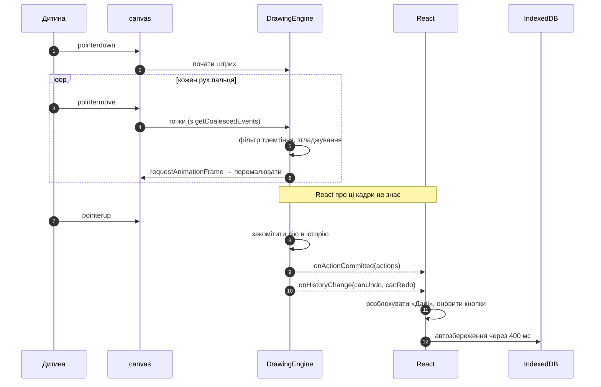

React дізнається лише про **завершені дії** — після `pointerup`. Між натиском і
відпусканням усе живе всередині рушія.

### Що робить рушій

| Тема | Рішення |
|---|---|
| Retina | внутрішній розмір полотна = CSS-розмір × `devicePixelRatio` |
| Ресайз | `ResizeObserver` на полотні, перемальовка з історії |
| Згладжування | квадратичні криві через середини сусідніх точок |
| Швидкі рухи | `getCoalescedEvents()` — жодна проміжна точка не губиться |
| Тремтіння | точки ближче 2 px відкидаються |
| Стилус | `pointerType === 'pen'`, ширина пензлика від `event.pressure` |
| Палмреджект | після дотику пером `touch`-події ігноруються 800 мс |
| Ластик | `globalCompositeOperation = 'destination-out'` — стирає лише шар дитини |
| Продуктивність | «закомічені» дії лежать на офскрин-полотні; живий штрих коштує одну `drawImage` |

### Історія

Один жест = одна дія. Глибина 50.

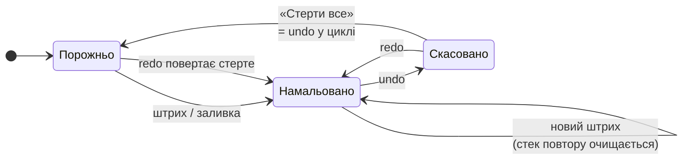

«Стерти все» перекладає всі дії в стек повтору, тому випадкове стирання
повертається кнопкою «вперед», а не втрачається назавжди.

## 2. Шари екрана малювання

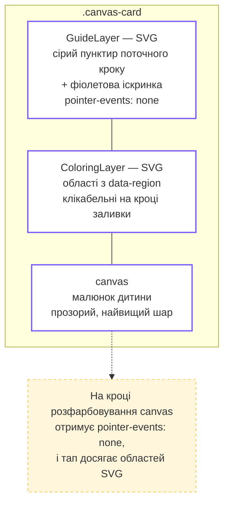

Ластик не може стерти гайд просто тому, що гайд живе в іншому шарі.

**Іскринка** — це копія SVG поточного кроку з фіолетовим штрихом. Довжина
кожної фігури вимірюється через `getTotalLength()`, і з неї рахується
`stroke-dasharray`; анімується `stroke-dashoffset`. (Коротший трюк
`pathLength="1"` мовчки не спрацьовує, якщо атрибут з'являється після того, як
браузер уже порахував пунктир, — і комета перетворюється на суцільну лінію.)

## 3. Контент: вправи як дані

Малюнки, літери й числа **не написані в коді**. Джерело — компактна геометрія
в `scripts/exercises/`, з якої генератор робить статичні файли.

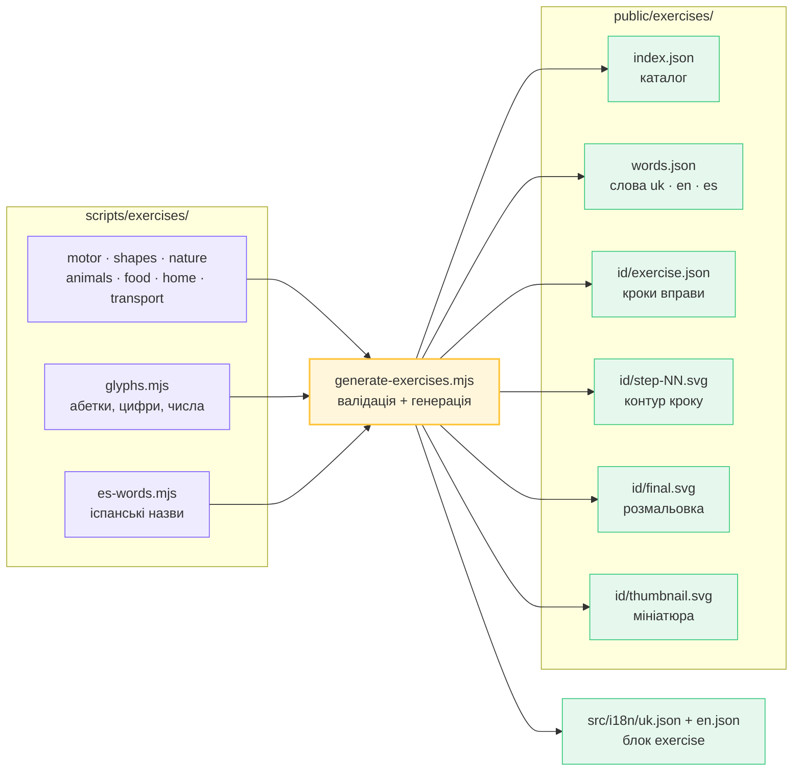

Генератор **валідує**: унікальні id, відома категорія, наявні назви обома
мовами. Назви вправ живуть поруч із геометрією, тому вправа фізично не може
потрапити в застосунок без перекладу.

### Дві SVG-ролі

- **step-NN.svg** — тільки контур: `fill="none"`, `stroke="currentColor"`.
  Колір і пунктир задає CSS, тому один файл працює і як активний гайд, і як
  блідий слід, і як іскринка.
- **final.svg** — заливні області (`data-region`) плюс повний контур поверх них.
  Без верхнього контуру розфарбована фігура втрачає обличчя і читається як пляма.

### Категорії та режими

Кожна категорія має `kind`: `draw` (малюнки) або `write` (літери, цифри, числа).
З цього будуються режими бібліотеки — код не знає імен категорій.

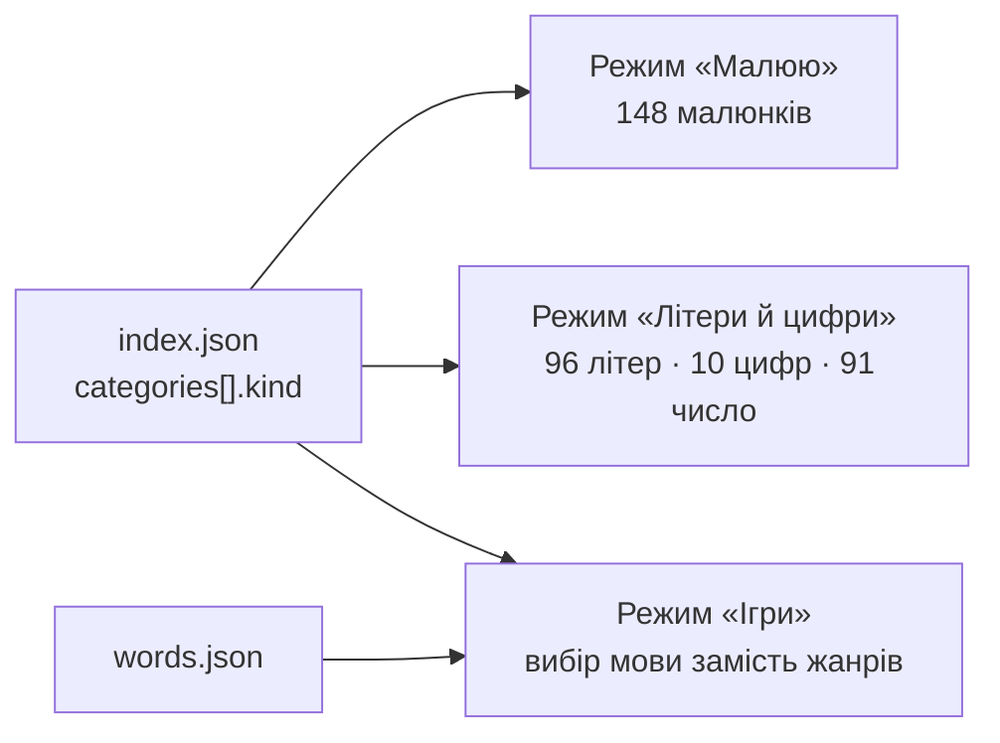

## 4. Дані на пристрої

Dexie над IndexedDB, база `drawli`:

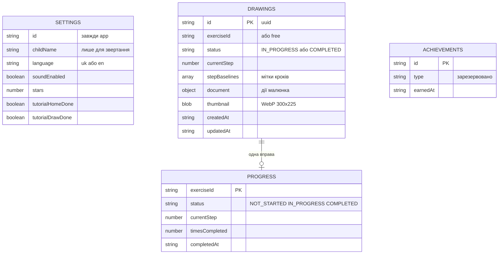

### Документ малюнка

```ts
interface DrawingDocument {
  version: 1
  exerciseId: string
  canvasWidth: number
  canvasHeight: number
  actions: DrawingAction[]   // STROKE | FILL
}
```

Координати й ширина штриха **нормалізовані до 0..1**. Малюнок, зроблений на
iPad, коректно перемальовується на Android-планшеті з іншою роздільністю.

### Мітки кроків

`SavedDrawing.stepBaselines[i]` — скільки дій існувало, коли відкрився крок `i`.
Без цього повернення до незавершеного малюнка вимагало б зайвого штриха на
роботі, яку дитина вже зробила, і кнопка «Готово» виглядала б мертвою.

### Автозбереження

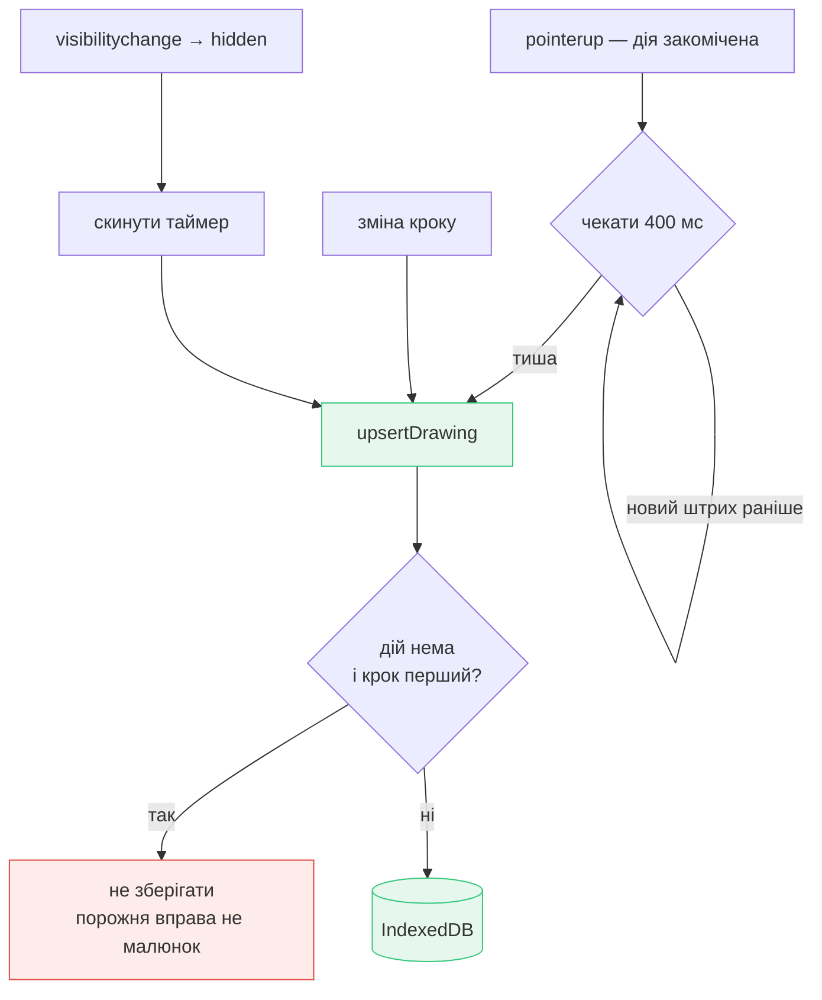

## 5. Стан застосунку

`zustand` тримає лише те, що спільне для екранів: налаштування, обраний
інструмент, обраний колір, стан завантаження. Усе інше — локальний стан
сторінок.

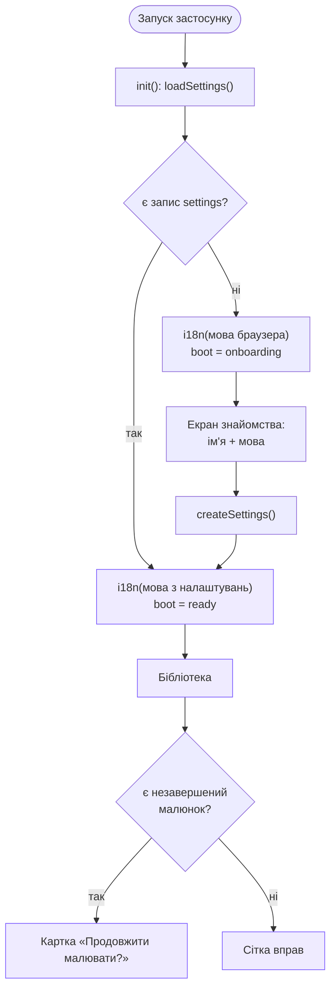

## 6. Маршрути

Використовується `HashRouter`, бо GitHub Pages не має SPA-fallback: посилання
`/drawli/draw/ladybug` віддало б 404 при перезавантаженні.

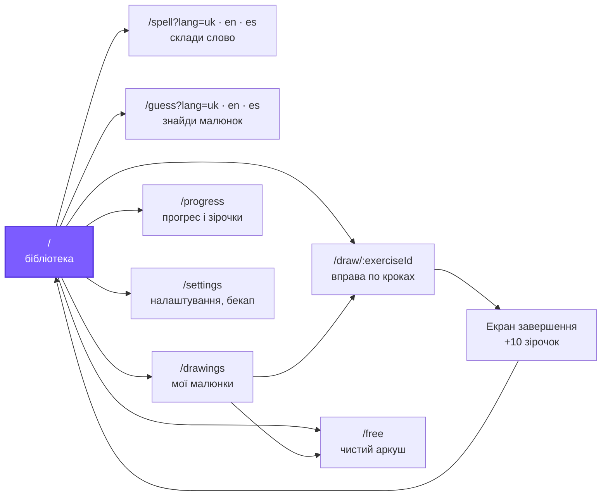

## 7. Офлайн

`vite-plugin-pwa` (Workbox), `registerType: 'autoUpdate'`, scope прив'язаний до
базового шляху.

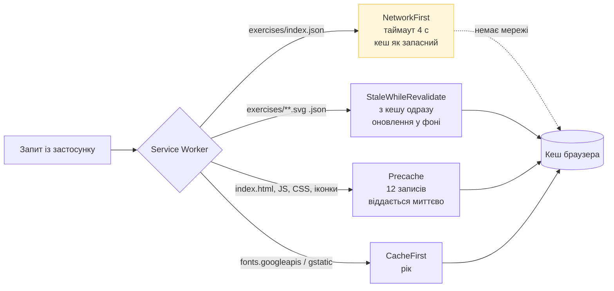

Сотні SVG **не** потрапляють у precache: інакше перше відкриття тягнуло б
мегабайти. Вправа кешується тоді, коли дитина її відкрила. Каталог береться з
мережі, коли вона є, — інакше нові вправи ніколи не дійшли б до планшета, який
уже відкривав застосунок.

## 8. Збірка та деплой

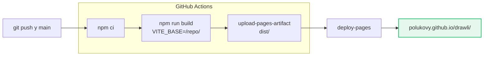

`base` у Vite обов'язковий: без нього всі шляхи вказували б у корінь домену.
Шляхи до вправ будуються через `import.meta.env.BASE_URL`, а не від `/`.

## 9. Структура коду

```
src/
  app/        App.tsx (гейт старту), router.tsx, store.ts
  pages/      HomePage, DrawingPage, FreeDrawPage, SpellGamePage,
              GuessGamePage, MyDrawingsPage, ProgressPage, SettingsPage,
              OnboardingPage
  components/ DrawingCanvas, DrawingToolbar, ColorPalette, GuideLayer,
              ColoringLayer, StepPreview, CoachMarks, CompletionScreen, Icon
  drawing/    DrawingEngine.ts, DrawingDocument.ts, thumbnail.ts,
              history/HistoryManager.ts
  exercise/   Exercise.ts (типи), ExerciseLoader.ts (fetch + кеш у пам'яті)
  storage/    DrawliDatabase.ts, DrawingRepository, ProgressRepository,
              SettingsRepository, types.ts
  backup/     BackupService.ts
  i18n/       uk.json, en.json, index.ts
  styles/     tokens.css, global.css, ui.css
scripts/      generate-exercises.mjs, exercise-data.mjs, exercises/*.mjs
```

Залежності між шарами односторонні:

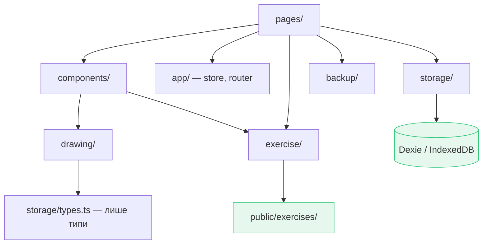

Рушій малювання не знає ні про React, ні про Dexie — лише про типи дій.

## 10. Рішення, які варто знати

- **Заливка областей замість flood-fill.** Дитина торкається вуха — фарбується
  вухо. Передбачувано і не залежить від того, наскільки акуратно вона обвела.
- **Мініатюра = кольори + штрихи.** Знімок самого полотна втрачає розфарбування,
  тому мініатюра складається з SVG-заливок і полотна поверх них.
- **Ніяких «неправильно».** Крок відкривається після першої дії, гра повертає
  зайві літери й підказує першу — прогрес ніколи не блокується точністю.
- **Порожня вправа не зберігається.** Інакше відкрита й покинута вправа
  засмічувала б галерею й перехоплювала картку «Продовжити».
